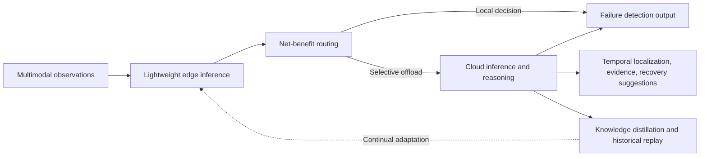

# RoboSense

### An Edge–Cloud Collaborative Framework for Multimodal Robot Failure Detection

RoboSense combines lightweight edge inference, net-benefit-based cloud routing, and continual cloud-to-edge adaptation for robot execution monitoring. It uses multimodal observations to detect failures and produce structured analyses with temporal localization, supporting evidence, and recovery suggestions.


> **Release status:** This package contains project documentation and a repository scaffold. Implementation, model weights, datasets, and executable reproduction commands are not included. Results below are reported in the manuscript; they have not been reproduced by this package.

## Key features

- **Multimodal monitoring:** combines video, audio, and proprioceptive signals, according to dataset availability.
- **Lightweight edge inference:** supports local failure detection during robot execution.
- **Net-benefit routing:** selectively requests cloud assistance based on its anticipated benefit relative to offloading cost.
- **Continual adaptation:** transfers cloud knowledge to the edge through knowledge distillation and historical replay.
- **Structured failure reasoning:** provides temporal localization, evidence, and recovery suggestions.

## Framework overview



The edge model evaluates incoming observations. The routing component determines when cloud assistance is useful. Cloud feedback supports detailed failure analysis and continual edge adaptation. This diagram is a conceptual overview, not an implementation specification.

## Datasets

The manuscript evaluates RoboSense on four datasets with the following episode-level splits:

| Dataset | Training | Deployment | ID test | OOD test |
| --- | ---: | ---: | ---: | ---: |
| REASSEMBLE | 1,935 | 111 | 425 | 84 |
| RoboFAC | 2,220 | 392 | 5,534 | 1,186 |
| ImperfectPour | 193 | 64 | 89 | 59 |
| FAILURE | 80 | 31 | 32 | 29 |

ID and OOD denote in-distribution and out-of-distribution evaluation. Dataset files are not redistributed in this package. Access instructions, licensing information, preprocessing details, and split manifests are pending; see [dataset documentation](docs/datasets.md).

## Results summary

| Measure | Manuscript-reported result | Scope |
| --- | --- | --- |
| Overall Macro F1 | 76.1–80.1% | Range across four datasets |
| End-to-end latency reduction | 61.7% | Average across four datasets vs. cloud-only inference |
| Communication cost reduction | 99.3% | Average across four datasets vs. cloud-only inference |
| Explanation correctness | 82.1% | Structured failure analysis evaluation |
| Evidence grounding | 76.5% | Structured failure analysis evaluation |

These values summarize the manuscript and do not imply that all metrics share the same evaluation subset. Exact protocols, hardware, metric definitions, and per-dataset results should be read alongside the anonymized paper. See [results documentation](docs/results.md) for outstanding reproduction details.

## Repository layout

```text
robosense-anonymous/
├── README.md
├── .gitignore
├── LICENSE.placeholder
├── citation.bib
├── assets/
│   └── README.md
├── configs/
│   └── README.md
├── scripts/
│   └── README.md
├── src/
│   └── README.md
├── data/
│   └── README.md
└── docs/
    ├── setup.md
    ├── usage.md
    ├── datasets.md
    ├── results.md
    └── anonymity.md
```

## Installation and setup

**Placeholder — implementation release pending.**

1. Obtain the anonymous repository archive and extract it.
2. Follow [setup documentation](docs/setup.md) once the supported environment and dependency versions are supplied.
3. Obtain permitted datasets and model weights using the forthcoming access instructions.
4. Configure local data locations and cloud access using the forthcoming configuration template.

There is currently no installation command or runnable package. Required software versions, hardware requirements, dependency files, model identifiers, and cloud configuration remain to be supplied.

## Usage

**Placeholder — commands will accompany the implementation.**

The intended workflow is data preparation, edge inference, selective cloud routing, cloud-to-edge adaptation, and evaluation. See [usage documentation](docs/usage.md) for the planned entry points and expected documentation. No example command in this release should be treated as executable.

## Citation

For the review version, use this anonymous placeholder. Replace the title, year, and paper URL with the corresponding anonymous submission details before use.

```bibtex
@misc{robosense_anonymous,
  author = {{}},
  title  = {{RoboSense}: [An Edge–Cloud Collaborative Framework for Multimodal Robot Failure Detection]},
  year   = {YYYY},
  note   = {Anonymous submission under review},
  url    = {ANONYMOUS_PAPER_URL}
}
```

The same entry is available in [citation.bib](citation.bib).

## License

**License selection pending.** [LICENSE.placeholder](LICENSE.placeholder) is a reminder to add the intended license; it is not a license grant. Dataset and model terms must be documented separately when those resources are added.

## Anonymity note

This scaffold intentionally omits author identities, affiliations, contact details, account handles, institutional identifiers, and links to non-anonymous project pages. The archive contains no Git history, source attachments, embedded media, or tracking badges. The paper URL remains a placeholder until an anonymized review copy is available.

Before adding files or publishing the repository, review [the anonymity checklist](docs/anonymity.md), including the paper's metadata and any repository history. Hosting account and platform metadata must also preserve anonymity.
